# System Architecture Diagrams - trippleCheck AI Agent

## 1. High-Level System Architecture

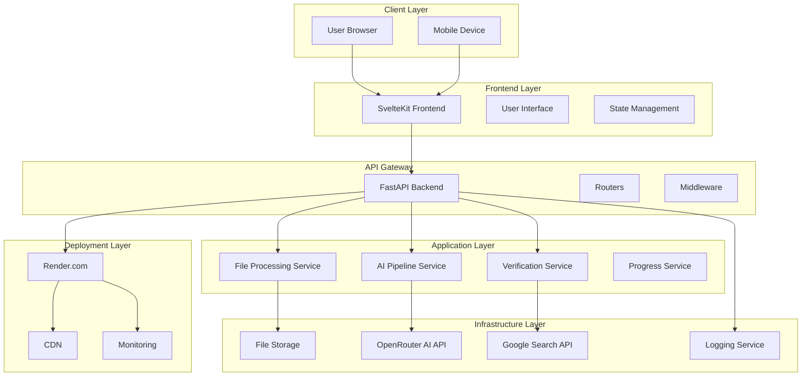

## 2. File Processing Pipeline

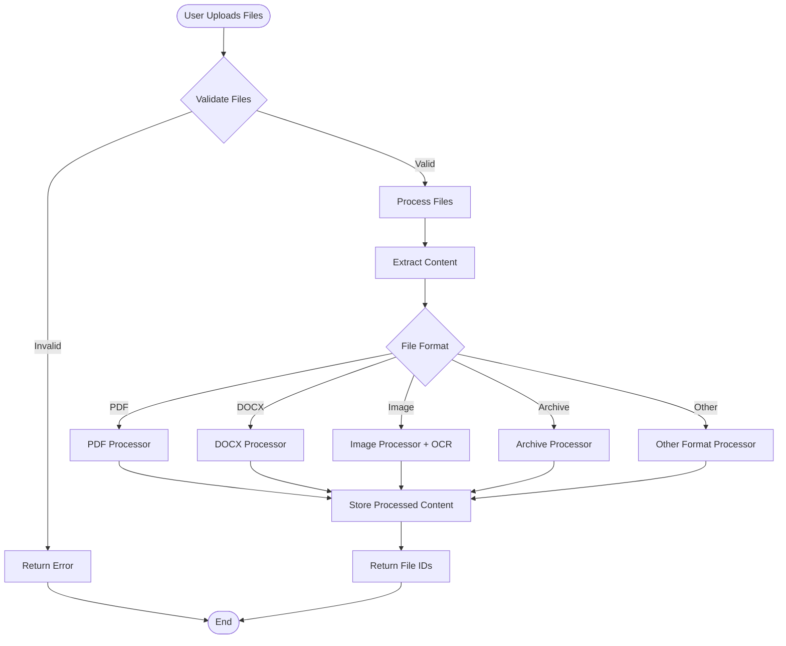

## 3. AI Processing Pipeline

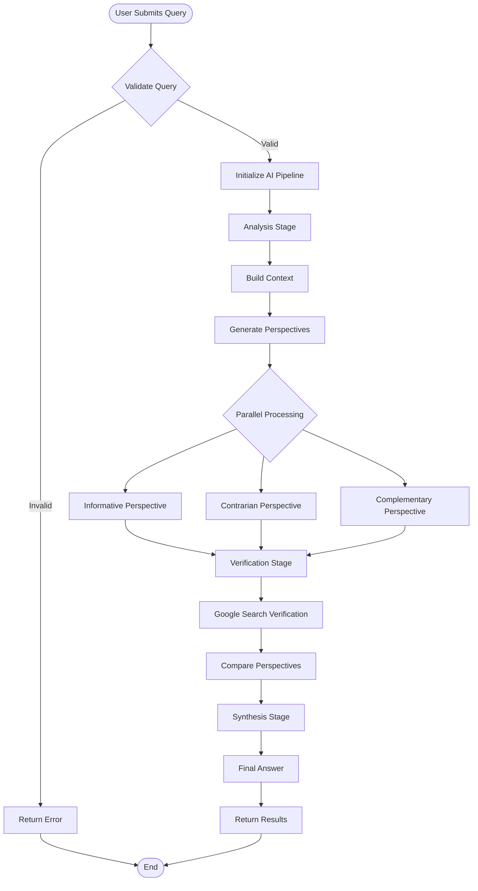

## 4. User Journey Flow

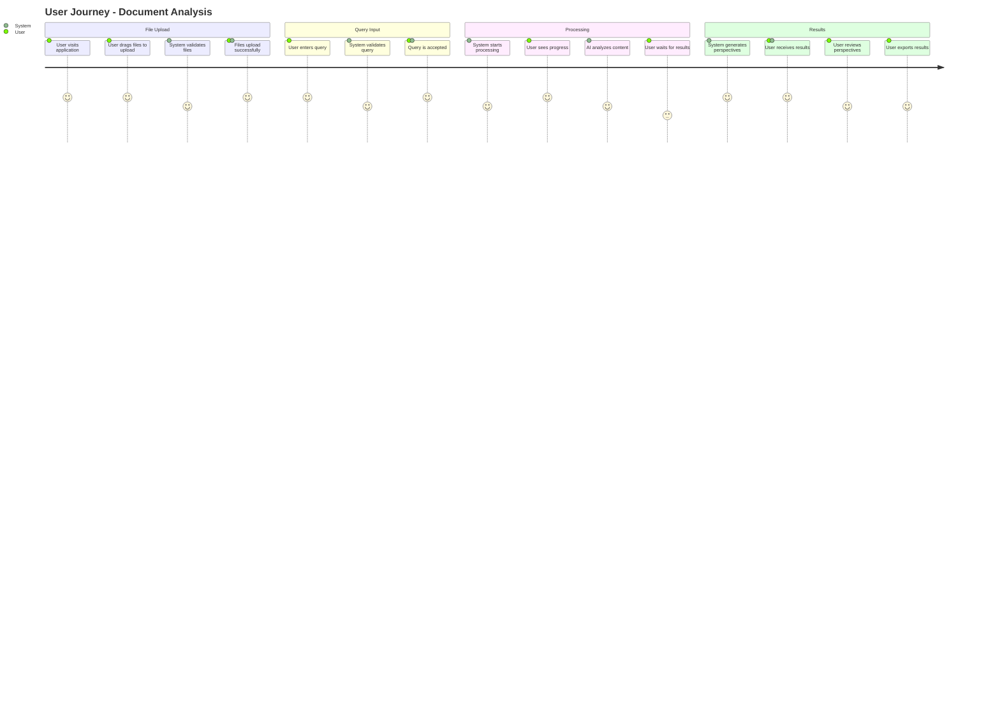

## 5. API Interaction Flow

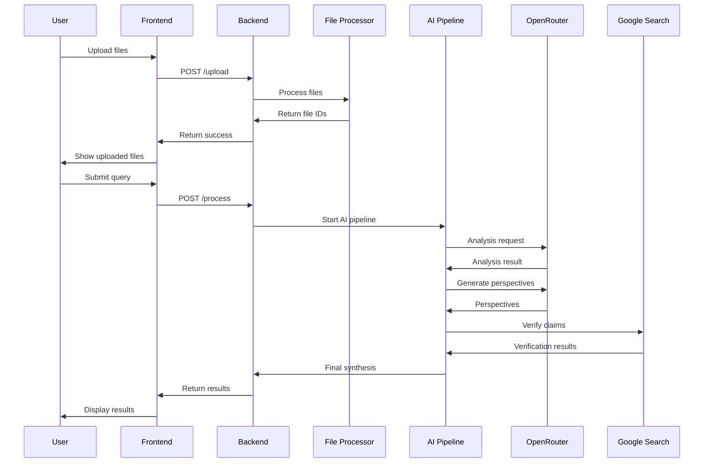

## 6. Component Architecture

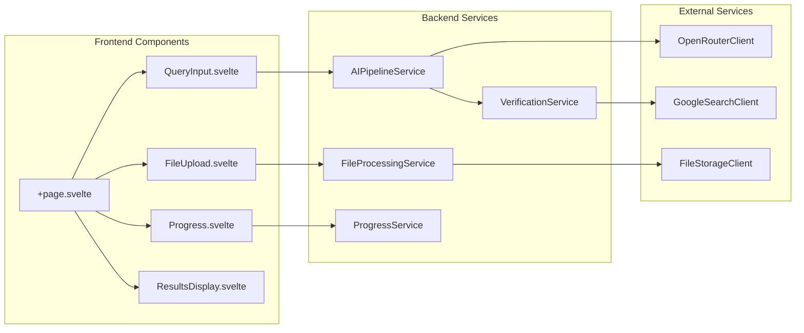

## 7. Data Flow Architecture

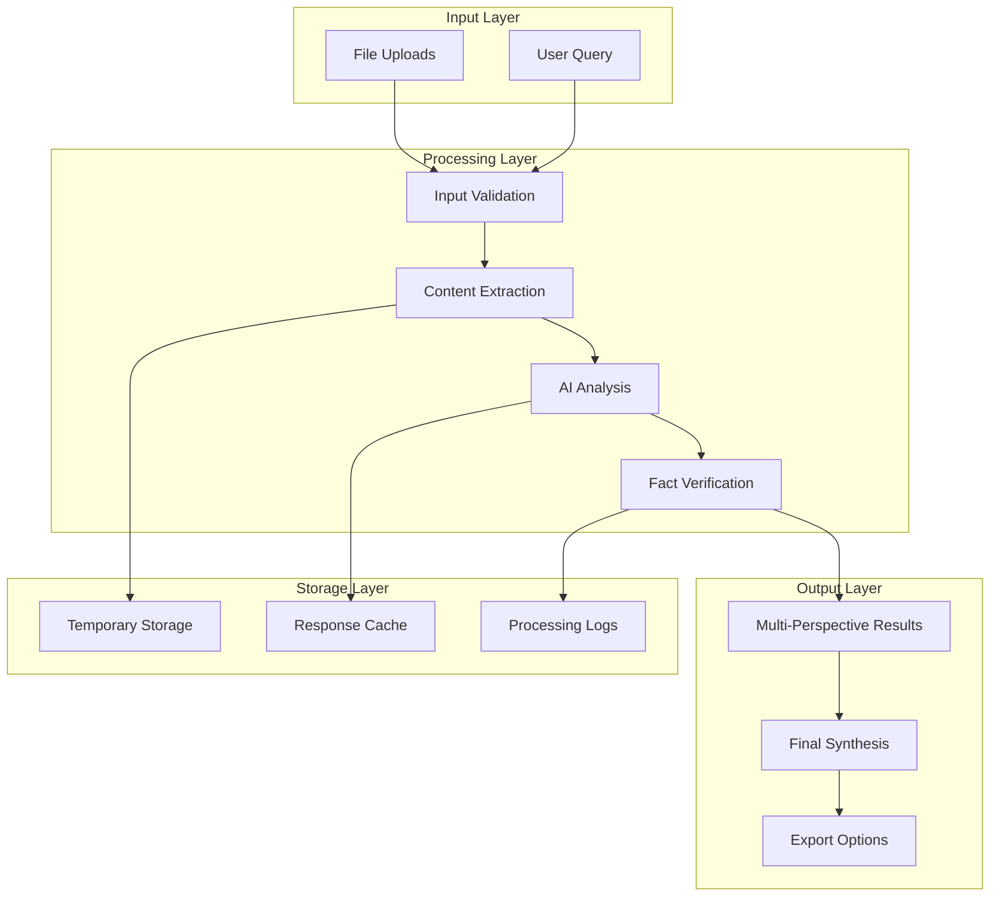

## 8. Security Architecture

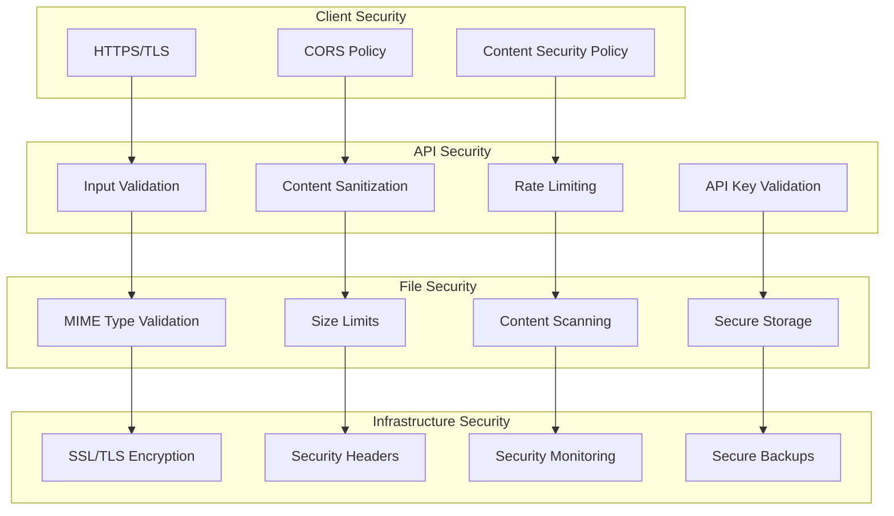

## 9. Deployment Architecture

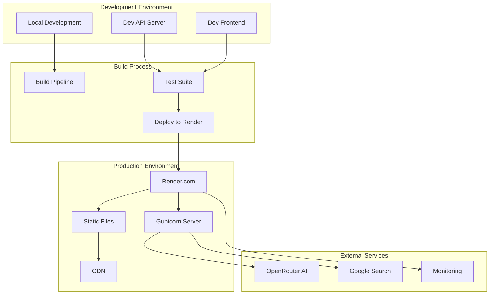

## 10. Error Handling Flow

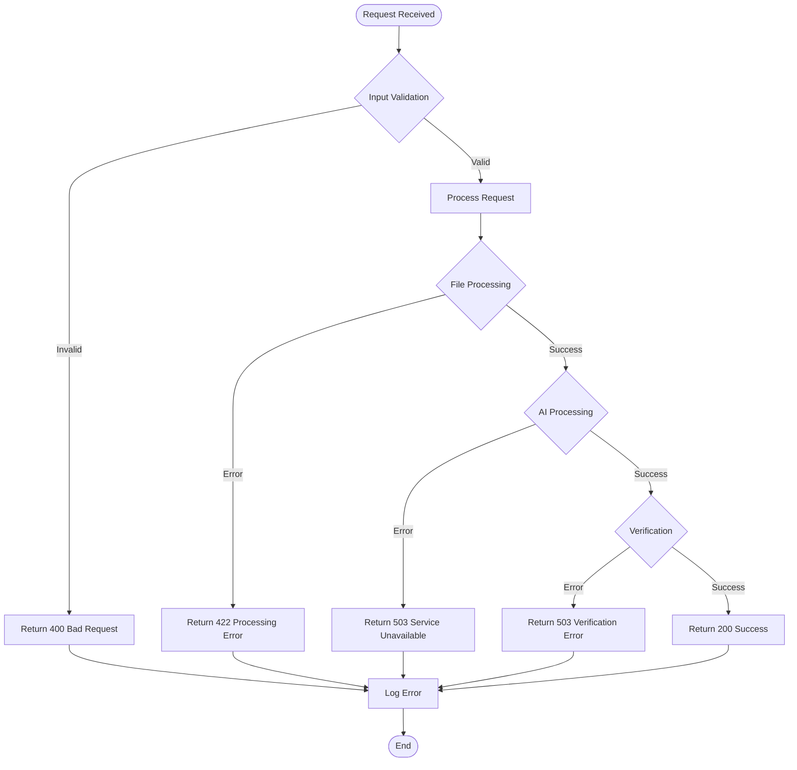

## 11. Performance Monitoring Flow

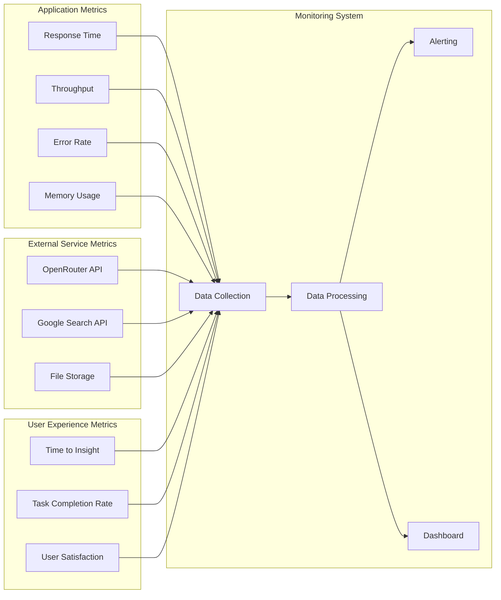

## 12. Memory Bank Integration Flow

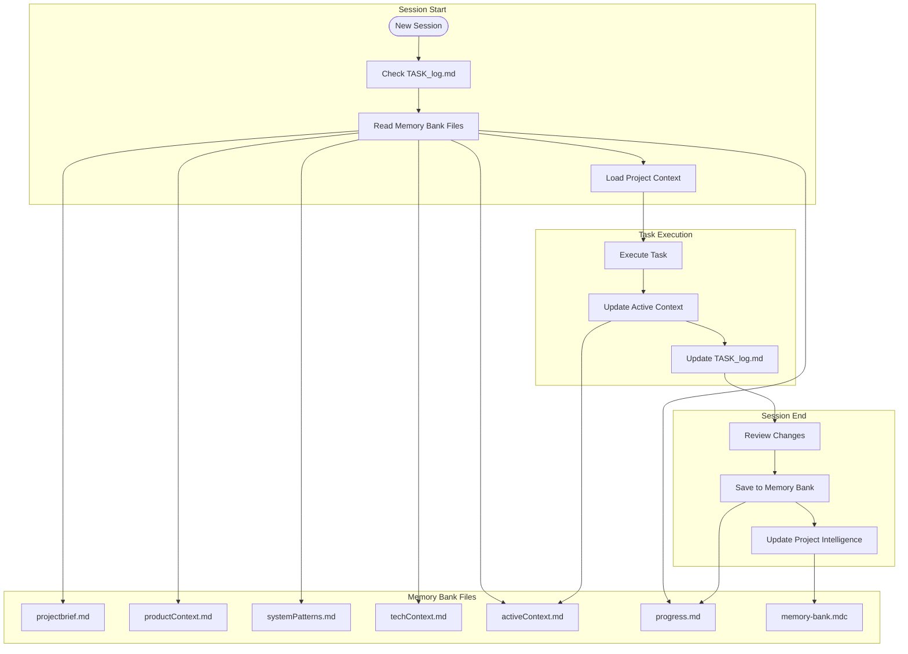

---

**Diagram Version**: 1.0.0  
**Last Updated**: 2024-12-19  
**Total Diagrams**: 12 comprehensive system diagrams  
**Coverage**: Architecture, flows, security, deployment, monitoring, and Memory Bank integration 