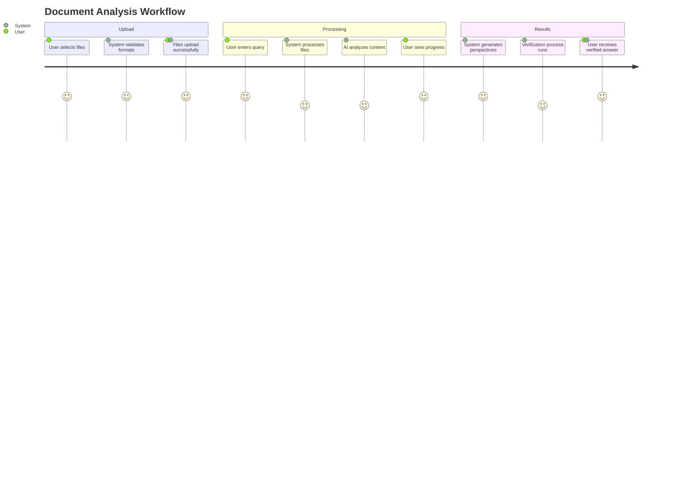
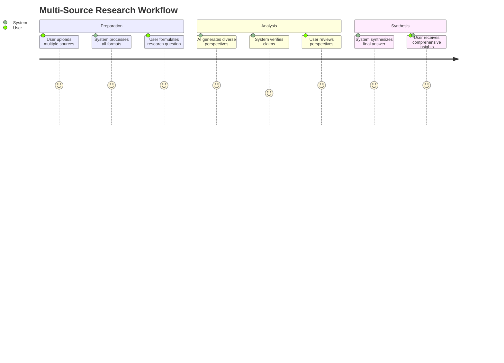

# Product Context - trippleCheck AI Agent

## Product Vision & Rationale

### The Problem We Solve
Knowledge workers, researchers, and content analysts face significant challenges when analyzing complex documents and generating insights:
- **Information Overload**: Processing multiple file formats and extracting relevant information is time-consuming
- **Verification Gap**: Manual fact-checking across multiple sources is error-prone and slow
- **Perspective Limitation**: Single-source analysis often misses important alternative viewpoints
- **Format Fragmentation**: Different file types require different tools and workflows

### Our Solution
trippleCheck provides an AI-powered platform that:
- **Unifies Processing**: Handles 20+ file formats in a single interface
- **Multi-Perspective Analysis**: Generates three distinct viewpoints (Informative, Contrarian, Complementary)
- **Verified Responses**: Fact-checks answers using Google Search integration
- **Intelligent Synthesis**: Combines perspectives into coherent, actionable insights

## Target Users & Personas

### Primary Personas

#### 1. Research Analyst (Sarah, 32)
**Job Story**: When I'm analyzing market research documents, I want to quickly extract key insights and verify claims so that I can provide accurate reports to stakeholders.

**Pain Points**:
- Spending hours manually cross-referencing data
- Missing important counter-arguments
- Difficulty processing multiple document formats
- Need for verified, trustworthy information

**Goals**:
- Rapid document analysis
- Verified fact-checking
- Multiple perspective generation
- Exportable insights

#### 2. Content Creator (Marcus, 28)
**Job Story**: When I'm writing content based on various sources, I want to understand different viewpoints and verify information so that I can create balanced, accurate content.

**Pain Points**:
- Time-consuming research across multiple sources
- Bias in single-source analysis
- Need for diverse perspectives
- Verification of claims and statistics

**Goals**:
- Quick multi-source analysis
- Balanced perspective generation
- Fact verification
- Content-ready insights

#### 3. Technical Writer (Elena, 35)
**Job Story**: When I'm creating technical documentation, I want to analyze existing materials and verify technical claims so that I can produce accurate, comprehensive documentation.

**Pain Points**:
- Processing technical documents in various formats
- Verifying technical specifications
- Understanding complex relationships
- Maintaining accuracy across multiple sources

**Goals**:
- Technical document processing
- Specification verification
- Relationship mapping
- Accuracy validation

## User Experience Goals

### Emotional Tone
**Calm & Confident**: Users should feel reassured that their analysis is thorough and verified
**Powerful & Efficient**: The system should feel capable and fast, reducing analysis time significantly
**Cinematic & Engaging**: The processing pipeline should feel dynamic and interesting to watch

### Core User Journeys

#### Journey 1: Document Analysis

#### Journey 2: Multi-Source Research

## User Input/Output Surface Mapping

### Input Endpoints

#### File Upload Interface
- **Drag & Drop Zone**: Accepts multiple file formats
- **File Browser**: Traditional file selection
- **Format Validation**: Real-time MIME type checking
- **Size Limits**: 10MB per file, 50MB total
- **Progress Indicator**: Real-time upload progress

#### Query Interface
- **Text Input**: Natural language query entry
- **Query Suggestions**: AI-powered query enhancement
- **Context Selection**: Choose which files to analyze
- **Processing Options**: Select analysis depth

#### API Endpoints
- `POST /upload` - File upload endpoint
- `POST /process` - Query processing endpoint
- `GET /status/{id}` - Processing status endpoint
- `GET /results/{id}` - Results retrieval endpoint

### Output Endpoints

#### Results Display
- **Perspective Cards**: Three distinct viewpoints
- **Verification Badges**: Fact-check status indicators
- **Source Attribution**: Links to verification sources
- **Confidence Scores**: AI confidence levels
- **Export Options**: PDF, JSON, Markdown formats

#### Progress Feedback
- **Processing Stages**: Visual pipeline progress
- **Time Estimates**: Remaining processing time
- **Error Handling**: Clear error messages and recovery
- **Success Indicators**: Completion confirmation

## Affordances & Interaction Patterns

### Primary Affordances
1. **File Upload**: Large, prominent drop zone with format indicators
2. **Query Input**: Clean, focused text area with character count
3. **Progress Tracking**: Visual pipeline with stage indicators
4. **Results Display**: Card-based layout with clear hierarchy
5. **Export Options**: One-click export with format selection

### Interaction Patterns
- **Progressive Disclosure**: Show complexity as needed
- **Immediate Feedback**: Real-time validation and status updates
- **Error Recovery**: Clear error messages with suggested actions
- **Contextual Help**: Inline help text and tooltips
- **Keyboard Navigation**: Full keyboard accessibility

## Success Metrics & KPIs

### User Experience Metrics
- **Task Completion Rate**: > 95% successful file processing
- **Time to Insight**: < 30 seconds from upload to results
- **Error Rate**: < 2% processing failures
- **User Satisfaction**: > 4.5/5 rating

### Engagement Metrics
- **Session Duration**: Average 5-10 minutes per session
- **File Upload Frequency**: 3-5 files per session
- **Query Complexity**: Mix of simple and complex queries
- **Return Usage**: > 70% weekly active users

### Quality Metrics
- **Verification Accuracy**: > 95% fact-check accuracy
- **Perspective Diversity**: Measurable viewpoint differences
- **Response Relevance**: > 90% query-answer relevance
- **Processing Speed**: < 15s average response time

## Competitive Landscape

### Direct Competitors
- **ChatPDF**: Limited to PDF files, no verification
- **DocuSign AI**: Focus on contracts, limited analysis
- **Adobe Acrobat AI**: PDF-only, no multi-perspective analysis

### Competitive Advantages
- **Multi-Format Support**: 20+ file formats vs. competitors' 1-3
- **Verification System**: Google Search integration for fact-checking
- **Multi-Perspective Analysis**: Three distinct viewpoints vs. single analysis
- **Real-Time Processing**: Live progress tracking vs. batch processing

## Future Vision

### Short-term (3-6 months)
- Enhanced OCR accuracy for complex documents
- Additional file format support
- Improved verification algorithms
- Mobile-responsive interface

### Medium-term (6-12 months)
- Collaborative analysis features
- Custom AI model fine-tuning
- Advanced export formats
- Integration with popular tools

### Long-term (12+ months)
- Real-time collaboration
- Enterprise-grade security
- Advanced analytics dashboard
- API marketplace for integrations 