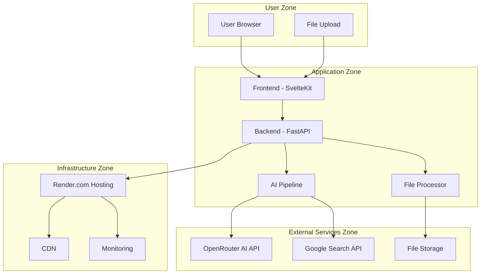

# Project Brief - trippleCheck AI Agent

## Project Overview
**Version:** 1.0.0  
**Created:** 2024-12-19  
**Last Updated:** 2024-12-19  
**Project Owner:** Development Team  
**Deadline:** Ongoing Development  

## Core Mission
trippleCheck is an AI-powered document analysis and query system that processes multiple file formats and provides intelligent, multi-perspective answers with verification through external sources.

## Primary Objectives
1. **Multi-Format Document Processing**: Support comprehensive file format handling including documents, spreadsheets, presentations, images, archives, and e-books
2. **AI-Powered Analysis**: Implement 3-step AI processing pipeline (Analysis → Perspective Generation → Verification & Synthesis)
3. **Verified Responses**: Provide fact-checked answers using Google Search integration
4. **User-Friendly Interface**: Deliver intuitive, responsive web interface with real-time processing feedback
5. **Scalable Architecture**: Build robust, maintainable system ready for production deployment

## Key Success Metrics
- **Performance**: File upload < 5s for 10MB, AI response < 15s, UI responsiveness < 100ms
- **Reliability**: 99.9% uptime, comprehensive error handling, automatic recovery
- **User Experience**: Intuitive interface, clear feedback, progressive enhancement
- **Security**: MIME type validation, content scanning, secure file handling

## System Boundary & Trust Zones

## Non-Functional Requirements

### Security Requirements
- **Authentication**: API key validation for external services
- **File Security**: MIME type validation, content scanning, size limitations
- **API Security**: Rate limiting, input validation, CORS configuration
- **Data Protection**: Secure storage, encryption in transit

### Performance Requirements
- **Response Time**: < 15s for AI processing, < 100ms for UI interactions
- **Throughput**: Support concurrent file processing
- **Scalability**: Horizontal scaling capability
- **Resource Usage**: Optimized memory and CPU utilization

### Compliance Requirements
- **Data Privacy**: GDPR-compliant data handling
- **Accessibility**: WCAG 2.1 AA compliance
- **Browser Support**: Modern browsers (last 2 versions)
- **Mobile Support**: Responsive design for all devices

## Technical Constraints
- **Python 3.8+** for backend development
- **Node.js 16+** for frontend development
- **Tesseract OCR 5.0+** for image processing
- **4GB RAM minimum** for development environment
- **500MB disk space** for application deployment

## Risk Assessment
- **Technical Risks**: AI API rate limits, file processing complexity, OCR accuracy
- **Resource Risks**: Development time, system dependencies, deployment complexity
- **Timeline Risks**: Integration challenges, testing requirements, documentation needs
- **Mitigation**: Phased development, comprehensive testing, fallback mechanisms

## Scope Boundaries

### In Scope
- Multi-format file processing and analysis
- AI-powered query processing with verification
- Web-based user interface
- Real-time processing feedback
- Basic monitoring and logging
- Production deployment on Render.com

### Out of Scope
- User authentication and user management
- Advanced collaboration features
- Custom AI model training
- Enterprise integrations
- Mobile applications
- Advanced analytics dashboard

## Success Criteria
- Successfully process all supported file formats
- Provide accurate, verified AI responses
- Maintain sub-15-second response times
- Achieve 99.9% uptime in production
- Pass comprehensive security testing
- Meet accessibility standards
- Complete user acceptance testing 