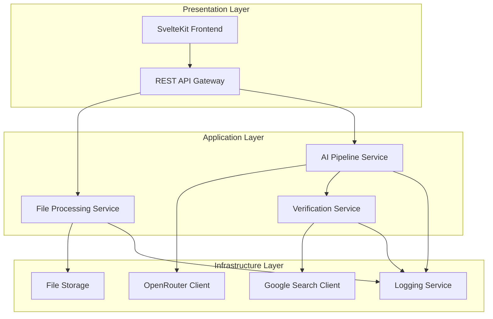
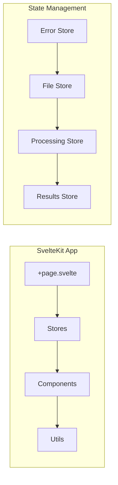
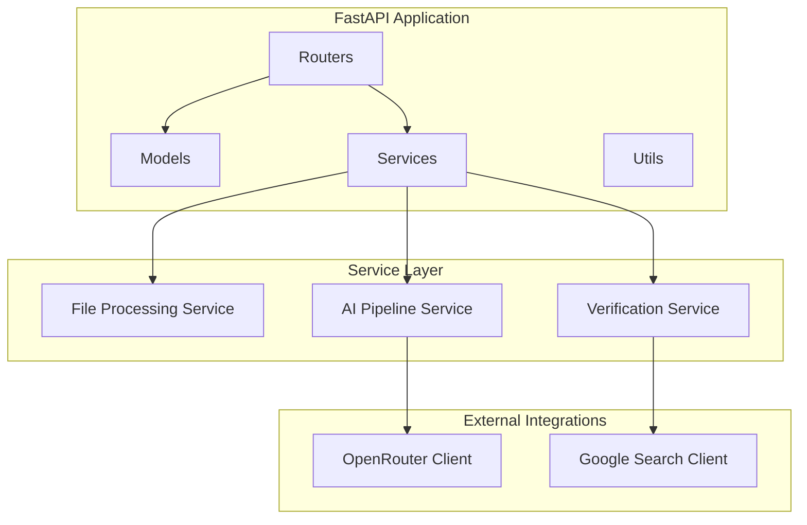
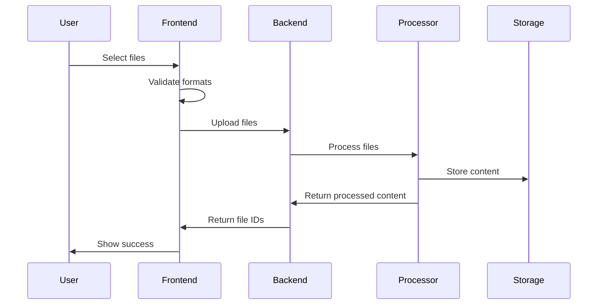
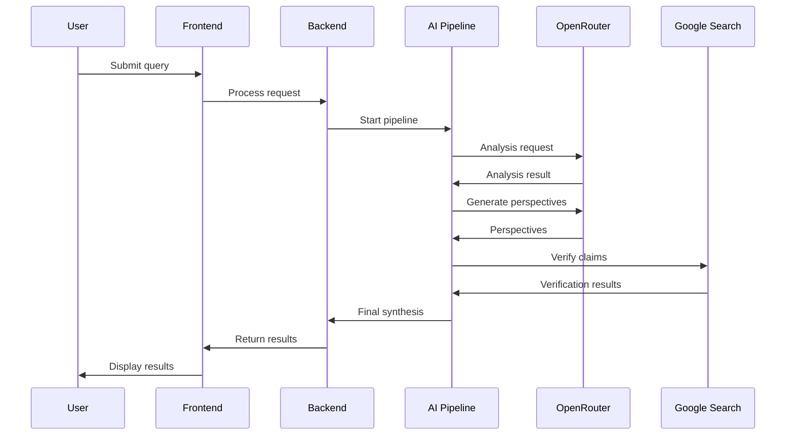

# System Patterns - trippleCheck AI Agent

## Architecture Overview

### System Architecture Pattern
trippleCheck follows a **Layered Architecture** with **Event-Driven Processing** for the AI pipeline:



### Component Architecture

#### Frontend Architecture (SvelteKit)


#### Backend Architecture (FastAPI)


## Design Patterns

### 1. Pipeline Pattern (AI Processing)
```python
# Pattern: Sequential Pipeline with Parallel Processing
class AIPipeline:
    def __init__(self):
        self.stages = [
            AnalysisStage(),
            PerspectiveGenerationStage(),  # Parallel execution
            VerificationStage(),
            SynthesisStage()
        ]
    
    async def process(self, query: str, context: str) -> PipelineResult:
        result = PipelineResult()
        for stage in self.stages:
            result = await stage.execute(result)
        return result
```

### 2. Strategy Pattern (File Processing)
```python
# Pattern: Strategy for Different File Types
class FileProcessor:
    def __init__(self):
        self.processors = {
            'pdf': PDFProcessor(),
            'docx': DocxProcessor(),
            'txt': TextProcessor(),
            'image': ImageProcessor(),
            # ... more processors
        }
    
    def process(self, file: UploadedFile) -> ProcessedContent:
        processor = self.processors.get(file.type)
        return processor.extract_content(file)
```

### 3. Observer Pattern (Progress Tracking)
```python
# Pattern: Real-time Progress Updates
class ProgressTracker:
    def __init__(self):
        self.observers = []
    
    def add_observer(self, observer):
        self.observers.append(observer)
    
    def notify_progress(self, stage: str, progress: float):
        for observer in self.observers:
            observer.update_progress(stage, progress)
```

### 4. Factory Pattern (AI Model Selection)
```python
# Pattern: AI Model Factory
class AIModelFactory:
    @staticmethod
    def create_model(model_type: str, task: str) -> AIModel:
        if task == "analysis":
            return AnalysisModel(model_type)
        elif task == "perspective":
            return PerspectiveModel(model_type)
        elif task == "verification":
            return VerificationModel(model_type)
```

## Code-Level Patterns

### Error Handling Pattern
```python
# Pattern: Consistent Error Handling
class ProcessingError(Exception):
    def __init__(self, message: str, error_code: str, details: dict = None):
        self.message = message
        self.error_code = error_code
        self.details = details or {}

# Usage in services
async def process_file(file: UploadedFile) -> ProcessedContent:
    try:
        return await file_processor.process(file)
    except UnsupportedFormatError as e:
        raise ProcessingError(
            "Unsupported file format",
            "UNSUPPORTED_FORMAT",
            {"format": file.type}
        )
    except ProcessingError:
        raise
    except Exception as e:
        logger.error(f"Unexpected error: {e}")
        raise ProcessingError("Internal processing error", "INTERNAL_ERROR")
```

### Validation Pattern
```python
# Pattern: Pydantic Validation
from pydantic import BaseModel, validator
from typing import List

class FileUploadRequest(BaseModel):
    files: List[UploadedFile]
    query: str
    
    @validator('files')
    def validate_files(cls, v):
        if not v:
            raise ValueError("At least one file is required")
        if len(v) > 10:
            raise ValueError("Maximum 10 files allowed")
        return v
    
    @validator('query')
    def validate_query(cls, v):
        if len(v.strip()) < 3:
            raise ValueError("Query must be at least 3 characters")
        return v.strip()
```

### Async Processing Pattern
```python
# Pattern: Async File Processing with Progress
async def process_files_async(files: List[UploadedFile]) -> List[ProcessedContent]:
    tasks = []
    for file in files:
        task = asyncio.create_task(process_single_file(file))
        tasks.append(task)
    
    results = await asyncio.gather(*tasks, return_exceptions=True)
    return [r for r in results if not isinstance(r, Exception)]
```

## Event Flow Patterns

### File Upload Flow


### AI Processing Flow


## Message Schemas

### File Upload Schema
```json
{
  "files": [
    {
      "name": "document.pdf",
      "type": "application/pdf",
      "size": 1024000,
      "content": "base64_encoded_content"
    }
  ],
  "query": "What are the main findings in this document?"
}
```

### Processing Response Schema
```json
{
  "status": "processing",
  "task_id": "uuid-string",
  "progress": {
    "stage": "perspective_generation",
    "percentage": 65,
    "estimated_time": 10
  }
}
```

### Results Schema
```json
{
  "status": "completed",
  "results": {
    "informative_perspective": {
      "content": "Main findings...",
      "confidence": 0.92,
      "sources": ["source1", "source2"]
    },
    "contrarian_perspective": {
      "content": "Alternative view...",
      "confidence": 0.85,
      "sources": ["source3"]
    },
    "complementary_perspective": {
      "content": "Additional context...",
      "confidence": 0.88,
      "sources": ["source4", "source5"]
    },
    "synthesis": {
      "content": "Combined analysis...",
      "verification_score": 0.94
    }
  }
}
```

## Error Design Patterns

### Error Response Schema
```json
{
  "error": {
    "code": "UNSUPPORTED_FORMAT",
    "message": "File format not supported",
    "details": {
      "format": "exe",
      "supported_formats": ["pdf", "docx", "txt"]
    },
    "timestamp": "2024-12-19T15:30:00Z"
  }
}
```

### Error Handling Strategy
1. **Validation Errors**: Return 400 with specific validation messages
2. **Processing Errors**: Return 422 with processing details
3. **External Service Errors**: Return 503 with retry information
4. **Internal Errors**: Return 500 with generic message, log details

## Pattern Graveyard

### Rejected Patterns & Why

#### 1. Microservices Architecture
**Why Rejected**: Over-engineering for current scale. Monolithic FastAPI app is sufficient and easier to maintain.

#### 2. Event Sourcing
**Why Rejected**: Complex for simple file processing. Traditional CRUD operations are more appropriate.

#### 3. CQRS Pattern
**Why Rejected**: Unnecessary complexity. Simple read/write operations don't require command/query separation.

#### 4. Saga Pattern
**Why Rejected**: File processing is not a distributed transaction. Simple pipeline processing is more appropriate.

## Performance Patterns

### Caching Strategy
```python
# Pattern: Multi-level Caching
class CacheManager:
    def __init__(self):
        self.memory_cache = {}  # In-memory cache
        self.redis_cache = RedisCache()  # Distributed cache
    
    async def get(self, key: str):
        # Check memory cache first
        if key in self.memory_cache:
            return self.memory_cache[key]
        
        # Check Redis cache
        value = await self.redis_cache.get(key)
        if value:
            self.memory_cache[key] = value
            return value
        
        return None
```

### Connection Pooling
```python
# Pattern: HTTP Connection Pooling
import httpx

class HTTPClient:
    def __init__(self):
        self.client = httpx.AsyncClient(
            limits=httpx.Limits(max_connections=20, max_keepalive_connections=10),
            timeout=30.0
        )
```

## Security Patterns

### Input Sanitization
```python
# Pattern: Comprehensive Input Validation
import re
from typing import List

def sanitize_filename(filename: str) -> str:
    # Remove dangerous characters
    filename = re.sub(r'[<>:"/\\|?*]', '', filename)
    # Limit length
    return filename[:255]

def validate_file_content(content: bytes, mime_type: str) -> bool:
    # Check file signature
    # Validate content structure
    # Scan for malicious content
    return True
```

### Rate Limiting
```python
# Pattern: Token Bucket Rate Limiting
from fastapi import HTTPException
import time

class RateLimiter:
    def __init__(self, requests_per_minute: int = 60):
        self.requests_per_minute = requests_per_minute
        self.requests = []
    
    def is_allowed(self, user_id: str) -> bool:
        now = time.time()
        # Remove old requests
        self.requests = [req for req in self.requests if now - req < 60]
        
        if len(self.requests) >= self.requests_per_minute:
            return False
        
        self.requests.append(now)
        return True
``` 